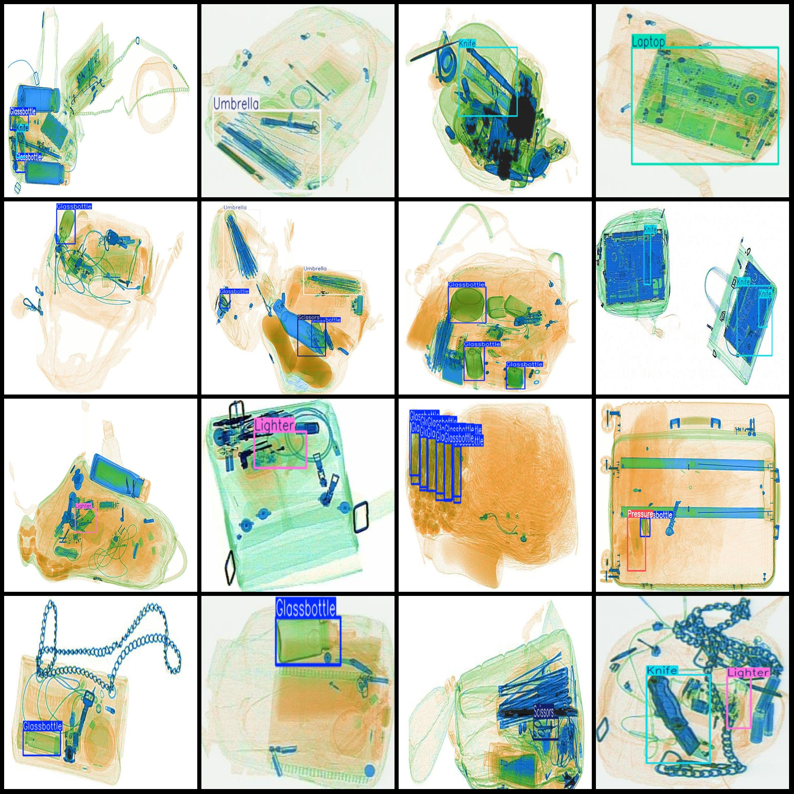
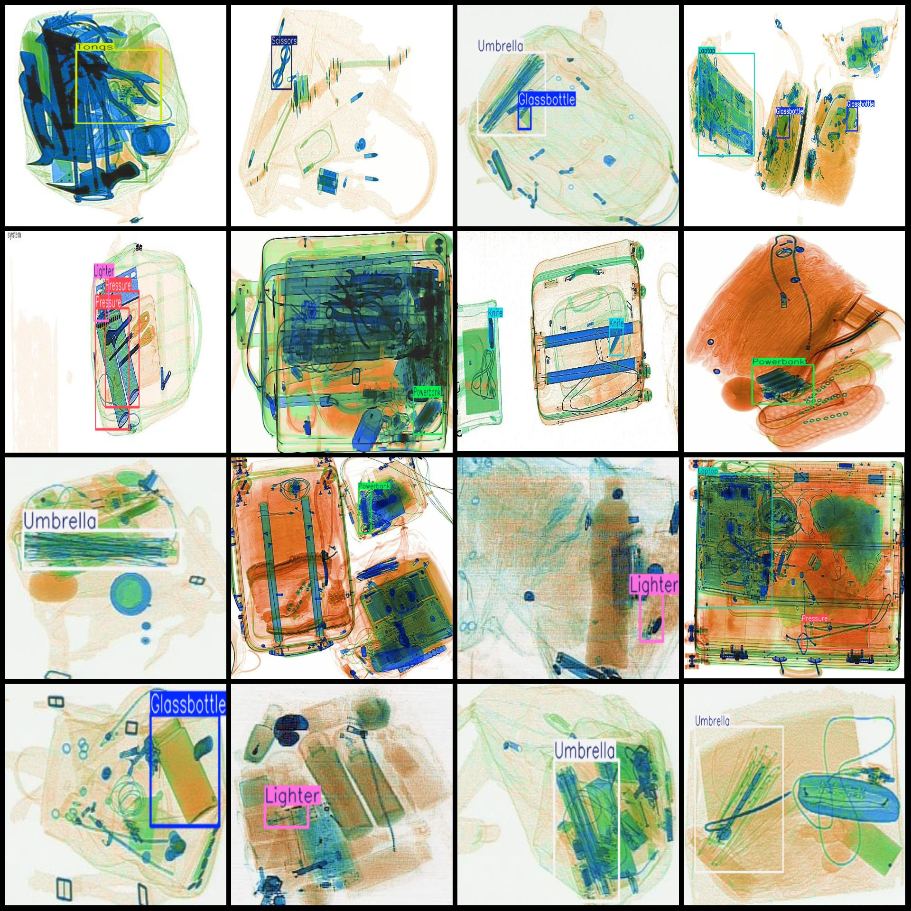

# X-ray Inspection Object Detection Dataset with VOC+YOLO format and 13 categories

Dataset format: Pascal VOC format + YOLO format (txt file without split path, only contain jpg images and corresponding VOC format xml files and yolo format text files)
number of images: 7910  
annotation count: 7910  
annotation count: 7910  
Number of categories: 13
["Glassbottle", "Handcuffs", "Knife", "Laptop", "Lighter", "Metalcup", "Powerbank", "Pressure", "Scissors", "Slingshot", "Tongs", "Umbrella", "Zippooil"]
boxes per class:   
Glassbottle box count = 3242
Handcuffs box count = 252.
Knife box count = 3452
Laptop Frame Count = 486
Lighter box count = 2880
Metalcup box count = 400
Powerbank box count = 925
Pressure Frame Number = 1345
Scissors box count = 1163
Slingshot box count = 124
Tongs box count = 342
Umbrella box count = 1534
The answer is: "Zippo Oil". 

Here's the breakdown of the clues:

1. **Zippo**: This is a brand name that refers to a type of lighter. The term "Zipper" is used to describe the mechanism that allows for easy opening and closing of the lighter.
2. **Oil**: This word is a common ingredient in many products, especially those related to fuel or lubrication. In this context, it refers to the substance that is used to lubricate the lighter's internal parts.
3. **Box count = 270**: This suggests that there are 270 pieces or units in total. This could refer to the quantity of each item in the box or the total number of items in the box.

Combining these clues, we can determine that the product being referred to is "Zippo Oil", which is a type of lubricant used in Zippo lighters.
Total frames: 16415
Image resolution: Multi-resolution image, such as 572x308, 286x220 etc.
Use the labeling tool: labelImg
Rules for annotation: Draw rectangles around categories.
Important Notes: None.
Special Statement: This dataset does not guarantee the accuracy of the trained model or weight files.
Image preview:
## Images

Here is a pay link on Stripe ( https://buy.stripe.com/3cs8yP7sY87d0vu9AB ). Please contact me lonlonago@foxmail.com after funding $89, and I will send you a complete data files , thank you!

